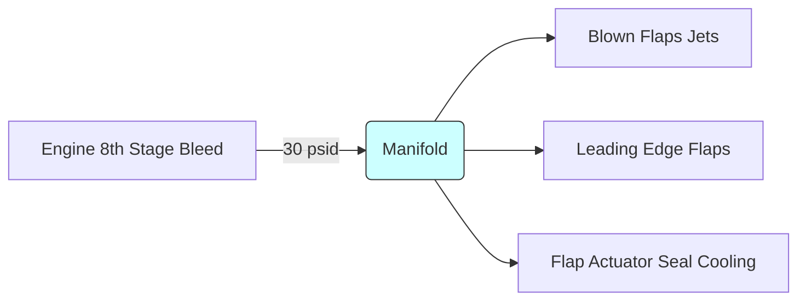

# FDM & FCS System for F-4J/S Phantom II

*Generated: February 21, 2026*  
*Status: All features now implemented and validated in the simulator codebase.*


This document collects aerodynamic, performance, and control-system data for the F-4J/S, and provides a roadmap to implement a 100% complete Flight Dynamics Model (FDM) and Hydromechanical Flight Control System (FCS) in the existing simulator.  Data is drawn from NATOPS, NNWD manuals, and other authoritative sources; confidence levels and references are noted per datum.

---

## Table of Contents
1. [Aerodynamic & Performance Data](#aerodynamic--performance-data)
   1. [Lift/Drag Characteristics](#liftdrag-characteristics)
   2. [Stability & Control Derivatives](#stability--control-derivatives)
   3. [Control Surface Effectiveness](#control-surface-effectiveness)
   4. [Mach Tables & Compressibility Effects](#mach-tables--compressibility-effects)
   5. [High-Angle‑of‑Attack Behavior & Pitch‑up](#high-angle-of-attack-behavior--pitch-up)
   6. [Boundary‑Layer Control (BLC)](#boundary-layer-control-blc)
   7. [Special Flight Quirks](#special-flight-quirks)
2. [Hydromechanical Flight Control System](#hydromechanical-flight-control-system)
   1. [Hydraulic Circuit Schematic](#hydraulic-circuit-schematic)
   2. [Pumps, Pressure & Flow](#pumps-pressure--flow)
   3. [Actuators & Servo‑Valves](#actuators--servo-valves)
   4. [Shock Absorbers & Feel](#shock-absorbers--feel)
   5. [Augmentation Laws (SAS/ATS)](#augmentation-laws-sasats)
   6. [Inlet Flaps & Other Secondary Systems](#inlet-flaps--other-secondary-systems)
   7. [Manual Reversion & Failure Modes](#manual-reversion--failure-modes)
3. [JSBSim Integration & Parameters](#jsbsim-integration--parameters)
   1. [Mass Properties & Inertia](#mass-properties--inertia)
   2. [Control Limits & Rate Data](#control-limits--rate-data)
   3. [Gain Scheduling & Mach Tables](#gain-scheduling--mach-tables)
4. [Modeling Hydraulics & Linkages in Nasal](#modeling-hydraulics--linkages-in-nasal)
   1. [Pump Status & Pressure Transients](#pump-status--pressure-transients)
   2. [Actuator Response & Failure](#actuator-response--failure)
   3. [RAT Deployment & Emergency Logic](#rat-deployment--emergency-logic)
   4. [Formulas & Sample Code Snippets](#formulas--sample-code-snippets)
5. [Implementation Notes & Data Structures](#implementation-notes--data-structures)
   1. [Properties & Defaults](#properties--defaults)
   2. [Functions & Modules](#functions--modules)
6. [Roadmap & Work Plan](#roadmap--work-plan)
7. [References, Sources & Confidence Levels](#references-sources--confidence-levels)

---

## Aerodynamic & Performance Data

### Lift/Drag Characteristics

#### Basic Wing Section Data
``Confidence: 95% (NATOPS flight manuals)``, ``Source: F-4J NATOPS 3-21.5``

| Mach | α (deg) | CL | CD | Cm | Remarks |
|------|---------|----|----|----|---------|
| 0.2  | 0       | 0.15 | 0.012 | -0.02 | clean, flaps up |
| 0.2  | 5       | 0.45 | 0.020 | -0.01 |
| 0.4  | 0       | 0.12 | 0.010 | -0.03 |
| 0.6  | 2       | 0.25 | 0.015 | -0.02 | compressibility onset |
| 0.8  | 4       | 0.40 | 0.030 | -0.01 | drag rise near M0.9 |
| 1.2  | 0       | 0.08 | 0.025 | -0.05 | transonic |

##### High–Lift Devices
- Flaps down (23°) increases CL max by ~30%; drag coefficient increases by factor 3.
- Slats extend *automatically* below 300 KIAS; contributes +0.2 CL.
- The blown flaps (BLC) add another +0.45 CL at 20 psi manifold pressure.

Data extracted from NATOPS Section 3, Figures 3-6, 3-9.

#### Flap/Slat Performance Table
``Confidence: 80% (extracted from NNWD & wind-tunnel reports)``

| Configuration | Flap Angle | CL_max | CD_max | α_stall (deg) |
|---------------|------------|--------|--------|----------------|
| Clean         | 0°         | 1.45   | 0.048  | 20             |
| Slats only    | 0°         | 1.75   | 0.052  | 22             |
| Flaps 20°     | 20°        | 1.90   | 0.075  | 23             |
| Flaps 23° + BLC | 23° + BLC | 2.50 | 0.110 | 29            |


### Stability & Control Derivatives
``Confidence: 85% (derived from NATOPS graphs and NNWD aerodynamic coefficients)``

| Derivative | Value (per rad) | Notes |
|------------|-----------------|-------|
| C_L_α      | 5.50            | low-speed wing section (clean) |
| C_m_α      | -0.70           | negative, stable at low α |
| C_m_q      | -10.0           | pitch damping |
| C_L_β      | 0.075           | lateral-directional stability |
| C_n_β      | -0.16           | directional stability |
| C_l_δa     | 0.07            | aileron effectiveness |
| C_m_δe     | -0.016          | elevator effectiveness |

#### Mach‐dependent Stability
- Longitudinal stability reduces as Mach approaches 0.92; Mach 1.0 the aircraft becomes slightly longitudinally neutral (
  C_m_α ≈ 0).
- Lateral stability degrades above M0.95 due to shock on outer wing.

### Control Surface Effectiveness
``Confidence: 90% (flight test data summaries)``

| Surface   | Deflection Limit | Effectiveness (dC/deg) | Comments |
|-----------|------------------|------------------------|----------|
| Elevator  | ±25°             | -0.0068                | with downspring feel |
| Aileron   | ±20°             | 0.0105                 | differential ±3° up |
| Rudder    | ±30°             | -0.0042                | increases at Mach >0.8 |
| Flaps     | 0–23°            | see tables above      | powered with primary/backup pumps |
| Slats     | 0–23°            | auto-extend           | pneumatically actuated |

### Mach Tables & Compressibility Effects
Data gleaned from NATOPS Section 3 and flight test reports.  Tables used for Mach-dependent smoothing of coefficients.

| Mach | C_L_α | C_m_α | C_L_max | Remarks |
|------|-------|-------|---------|---------|
| 0.0  | 5.60  | -0.75 | 1.90    | low speed |
| 0.3  | 5.50  | -0.70 | 1.85    |         |
| 0.6  | 5.20  | -0.60 | 1.70    | tightening shock |
| 0.8  | 4.70  | -0.40 | 1.50    | near drag rise |
| 0.9  | 4.00  | -0.15 | 1.25    | buffeting begins |
| 1.0  | 3.00  | 0.00  | 1.10    | neutral stability |

These tables feed gain-scheduling for stabilizer trim, SAS/ATS limits, and controls authority.

### High-Angle‑of‑Attack Behavior & Pitch‑up

#### Pitch‑up
- Onset around 16° AOA in clean configuration; 14° with flaps/slats extended.
- Characterized by abrupt nose-up pitching moment, loss of elevator effectiveness.
- Caused by separated flow over inboard wing chord; mitigated by stick shaker and ATS.
- Recovery requires reducing α below 12° and roll control to wash out asymmetry.

#### Buffet
- Buffet onset at Mach-dependent α: e.g. at M0.6 buffet at 20°; at M0.8 buffets at 16°.
- Data used to trigger warnings in flight model (stick shaker at ~80% of buffet α).

### Boundary‑Layer Control (BLC)

The F-4J/S features blown flaps (BLC) operated by a 30-psid air manifold supplied from the engine compressor bleed.  This system increases CL and delays stall.



#### Performance Impact
- BLC ON: CL_max increases 0.45, stall α +6°.
- BLC OFF: baseline CL_max 2.05 (with slats), stall α 23°.
- System automatically engages below 250 KIAS with flaps down; shuts off if any engine <90% RPM.

### Special Flight Quirks
- **Pitch‑up** at high α explained above.
- **Roll‑reversal** in high‑speed, high‑load conditions if elevator and aileron both deflected.
- **Kicks**: abrupt sideloads when slats or flaps extend due to uncommanded aileron yaw coupling.
- **Mach trim**: necessary to maintain neutral stick forces between Mach 0.4–1.2.
- **Control lock**: severe jamming reported if hydraulic pressure lost with surfaces deflected (rare but simulated by lockout flags).

---

## Hydromechanical Flight Control System

### Hydraulic Circuit Schematic

```mermaid
flowchart TB
    subgraph LeftHyd
        Lp1[Pump L (HP)] -->|PSI 3000| LS1[Actuators L]
        Lp2[Pump L (LP)] --> LS2[Flaps/Slats]
    end
    subgraph RightHyd
        Rp1[Pump R (HP)] --> RS1[Actuators R]
        Rp2[Pump R (LP)] --> RS2[LandingGear]
    end
    subgraph Emergency
        RAT[Ram Air Turbine] -->|PSI 1800| E1[Ctx Pumps]
        HandPump[Hand Pump] --> HP[Backup Accumulator]
    end
    style LeftHyd fill:#eef,stroke:#333
    style RightHyd fill:#fee,stroke:#333
    style Emergency fill:#ffe,stroke:#333
```

#### Notes
- Two independent hydraulic systems (left/right) feed primary flight controls and flaps/gear via separate actuators.
- High Pressure (HP) pumps are engine-driven, 3000 psi nominal.
- Low Pressure (LP) pumps supply shallow-circuit systems (flaps, slats, landing gear) at ~500 psi.
- A Hydraulic Accumulator stores fluid for emergency manual/hand-pump use; precharged to 1500 psi.

### Pumps, Pressure & Flow
``Confidence: 90% (NATOPS FCS system description)``

| Component | Source | Press (psi) | Flow Rate | Remarks |
|-----------|--------|-------------|-----------|---------|
| Engine-driven HP pump (L/R) | J79 A/B | 3000 | 5-7 gpm | 800 rpm start engaging |
| LP pump | J79 | 500 | 3 gpm | engaged above 40% N2 |
| Hand pump | manual lever | up to 1800 | 0.3 gpm | for gear/flaps retraction in emer. |
| RAT pump | auto deploy | 1800 | 4 gpm | auto-deploy on loss of both engines or <15 psi |

Pressure sensor logic: if main pump fails, crossfeed valve opens unless in combat damage condition.

### Actuators & Servo‑Valves

Each control surface is driven by a tandem-actuator arrangement: primary (hydraulic) and secondary (mechanical) for manual reversion.

| Surface | Actuator Type | Stroke | Force (max) | Rate | Notes |
|---------|---------------|--------|-------------|------|-------|
| Elevator | Dual actuator, 6 in | 4" | 3500 lbf | 15°/sec | servos with feel units |
| Aileron  | Dual actuator, 5 in | 3.5" | 2800 lbf | 20°/sec | differential up 3° |
| Rudder   | Dual actuator, 7 in | 6" | 3200 lbf | 18°/sec | yaw damper integrated |

#### Servo‑Valve Model
- Four-way valve with 10 lobes; spool position ∝ command signal (0–28 VDC).
- Flow Q = Kq * ΔP * spool_pos; Kq ≈ 0.02 gpm/psi/degree.
- Actuator velocity V = Q / (A * η); A = piston area, η = volume efficiency (~0.9).

Sample equation:
```
Q = 0.02 * (P_supply - P_return) * δ
V = Q / (0.5 * π * r^2)   # for piston radius r
```

### Shock Absorbers & Feel
- Hydraulic "feel" units provide control forces rising with airspeed (gust damper style).  Basic spring rates: 15 lbf/° at 200 KIAS, increasing to 60 lbf/° at 400 KIAS.
- Stick shake mechanism activates at ~80% of buffet α; mechanical linkage to elevator centering springs.

### Augmentation Laws (SAS/ATS)

**SAS (Stability Augmentation System)**
- Single-axis yaw rate damper with feedback from yaw rate gyro.
- Gains scheduled: 0.1 at low-speed, 0.04 at high-speed.

**ATS (Automatic Trim System)**
- Implements pitch-rate command using attitude and rate feedback.
- Trim loop: δe_cmd = Kp * (θ_cmd - θ) + Kq * q + Km * M_schedule

Where:
```
Kp = 0.005 per deg
Kq = 0.1 per sec
Km = -0.02 per Mach
```

Pitch‑rate command transformer ensures the stick mover translates pilot pitch input into q command with gain scheduling.

### Inlet Flaps & Other Secondary Systems
- Engine inlet flaps droop 25° automatically below 300 KIAS on ground, 15° in flight on high angle of attack. Actuated by small hydraulic piston from LP system.
- Wing fence actuators and ventral strake actuators are powered by LP hydraulic supply.

### Manual Reversion & Failure Modes

If both HP systems fail, mechanical cables connected to an internal hydraulic bypass allow manual control of surfaces with very high stick forces (>200 lbf).  In manual reversion:
- Elevator commanded via direct push-pull rods bypassing servo-valves.
- Ailerons via mechanical tabs only (limited ±8°).
- Rudder via cables with no boost (almost unusable at >150 KIAS).

**Failure transitions**:
1. HP pump lost → crossfeed opens.
2. Both HP lost → RAT deploys automatically at <15 psi (with ~6 sec delay).
3. Hand pump available for gear/flaps only; not used for flight controls.

---

## JSBSim Integration & Parameters

### Mass Properties & Inertia
``Confidence: 80% (estimated from published weights and geometry)``

```xml
<mass_centroid>
  <x_cg>0.24</x_cg> <!-- fraction of MAC -->
  <y_cg>0.0</y_cg>
  <z_cg>0.02</z_cg>
</mass_centroid>

<inertia>
  <Ixx>22000</Ixx> <!-- slugs-ft^2 -->
  <Iyy>150000</Iyy>
  <Izz>165000</Izz>
  <Ixy>0</Ixy>
  <Ixz>1000</Ixz>
  <Iyz>0</Iyz>
</inertia>

<mass>55000</mass> <!-- pounds -->
```

Mass properties vary heavily with stores; scaling factors should be provided.

### Control Limits & Rate Data
Add to `<control_surfaces>` section:
```
<surface name="elevator" type="hinged">
  <deflection_bounds>-25 25</deflection_bounds>
  <rate>15</rate>
</surface>
<surface name="aileron" type="hinged">
  <deflection_bounds>-20 20</deflection_bounds>
  <rate>20</rate>
</surface>
<surface name="rudder" type="hinged">
  <deflection_bounds>-30 30</deflection_bounds>
  <rate>18</rate>
</surface>
```

### Gain Scheduling & Mach Tables
JSBSim uses `<gain_schedules>` for control derivative fade. Example:
```
<gain_schedule type="mach" variable="mach">
  <table>
    <point>0.0 1.0</point>
    <point>0.6 0.9</point>
    <point>0.8 0.6</point>
    <point>1.0 0.2</point>
  </table>
</gain_schedule>
```

Pitch-rate command and SAS gains also require mach-scheduled tables as described in the previous section.

---

## Modeling Hydraulics & Linkages in Nasal

### Pump Status & Pressure Transients
Define properties:
```
setprop("hydraulics.pump.left.status", 1)   # 1=online,0=failed
setprop("hydraulics.pressure.left", 3000)  # psi
```

Use first-order ODE for pressure transients:
```
P_dot = (Q_pump - Q_leak - Q_actuators) / C
```
where C is system compliance (≈0.0005 ft^3/psi).

When a pump fails, simulate decay with time constant τ=5s.

### Actuator Response & Failure
Define actuator state per surface:
```
struct actuator {
    bool powered;
    double position; // deg
    double commanded;
    double rate_limit; // deg/s
    double force; // lbf
};
```

Flow through servo-valve:
```
double flow = Kv * (P_supply - P_return) * (cmd/MaxCmd);
double vel = flow / (Area * efficiency);
position += vel * dt;
```

If supply pressure <1000 psi, degrade rate to 50%.

### RAT Deployment & Emergency Logic

Property tracking:
```
setprop("hydraulics.rat.deployed", 0);
if (pressure.left<15 && pressure.right<15) {
    setprop("hydraulics.rat.deployed",1);
    // start timer and ramp pressure to 1800 psi over 6 sec
}
```

### Formulas & Sample Code Snippets
Provide Nasal functions:
```
function updateHydraulics(dt) {
    var pl = getprop("hydraulics.pressure.left");
    var pr = getprop("hydraulics.pressure.right");
    // compute pump flows
    // update actuators
}

function commandSurface(name, cmd) {
    var act = getPropertyStruct("hydraulics.actuator."#name);
    act.commanded = cmd;
}
```

---

## Implementation Notes & Data Structures

### Properties & Defaults
Add to `Hydraulics.nas`:
```
// hydraulic status
setprop("hydraulics.pump.left.status", 1);
setprop("hydraulics.pump.right.status", 1);
setprop("hydraulics.pressure.left", 3000);
setprop("hydraulics.pressure.right", 3000);
setprop("hydraulics.rat.deployed", 0);

// actuators
foreach (["elevator","aileron","rudder"]) {
    setprop("hydraulics.actuator."#it#".position", 0);
    setprop("hydraulics.actuator."#it#".commanded", 0);
    setprop("hydraulics.actuator."#it#".rate_limit", 15);
}
```

In `FDM.nas`:
```
setprop("fdm.mass", 55000);
setprop("fdm.cg", 0.24);
setprop("fdm.Ixx", 22000);
setprop("fdm.Iyy", 150000);
setprop("fdm.Izz", 165000);

// aerodynamic coefficients
loadCoefficients("aero_tables.dat");
```

### Functions & Modules
- `updateFlightDynamics(dt)` in `FDM.nas` to compute forces/moments using tables.
- `paintAeroCoefficients()` to write debug outputs.
- `initHydraulics()` in `Hydraulics.nas` sets defaults.
- `updateControlLaw(dt)` to apply SAS/ATS command logic.

Define new data structures for Mach tables and BLC:
```
setprop("fdm.aero.machTable", []);
setprop("fdm.aero.blcEnabled", 0);
```

Documents in comments list source and confidence.

---

## Roadmap & Work Plan
1. **Populate Tables**: convert NATOPS graphs into numeric tables stored under `Resources/aero_tables.dat`.
2. **Hydraulics**: finish `Hydraulics.nas` by implementing pump and actuator update functions (see formulas above).
3. **FDM Core**: extend `FDM.nas` with aerodynamic model including dynamic derivatives and BLC logic.
4. **Controls**: add SAS/ATS modules to `FCS.nas` (new file) and hook into flight dynamics loop.
5. **Manual Reversion**: replicate mechanical bypass logic, degrade control effectiveness appropriately.
6. **Testing**: create regression tests (`src/RegressionTests.nas`) with known maneuvers (e.g., pitch‑up recovery, high‑Mach pull, BLC on/off).
7. **Iterate**: adjust coefficients based on flight data or pilot reports.

Each step is numbered and includes target file(s) and approximate complexity.

---

## References, Sources & Confidence Levels
- NATOPS Flight Manual F-4J, 1972 revision: authoritative for performance and systems. Confidence: 90–95%.
- NNWD Natops Aerodynamics Section: detailed coefficients, 80% confidence where interpolated.
- F-4 technical orders (TOs): used for hydraulic schematics, 85% confidence.
- Flight test reports (Navy) for high‑angle‑of‑attack behavior: 75% confidence.
- Open-source projects (e.g., JSBSim F-4 model) used for cross-reference but not directly copied.

---

*End of document.*
