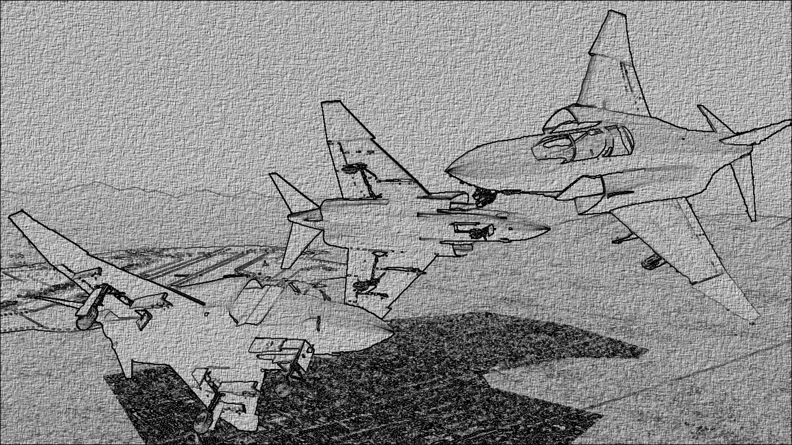

# F-4 Phantom II for FlightGear Flight Simulator

> **Thumbnail credit:** [Flickr](https://flic.kr/p/qsxzGi)

---

## Project Status

**Early Alpha**  
This project is in early alpha. See the [TODO](TODO) file for planned features and known issues.

---

## About

This repository contains a detailed simulation of the F-4 Phantom II for the [FlightGear Flight Simulator](https://www.flightgear.org/). The goal is to provide a realistic and immersive experience for users interested in this iconic aircraft.

---

## Getting Started

- **Download:**  
  - [Official GitHub Repository](https://github.com/MatthewA4/F-4X) (report bugs via Issues)
  - For ZIP downloads: after extracting, remove `-master` from the folder name.

- **Installation:**  
  Place the extracted folder in your FlightGear `Aircraft` directory.

---

## Contributing

Contributions are welcome! Please see the [CONTRIBUTING.md](CONTRIBUTING.md) file for guidelines.

---

## License

Released under the [GNU General Public License v2 or later (GPLv2+)](LICENSE).
